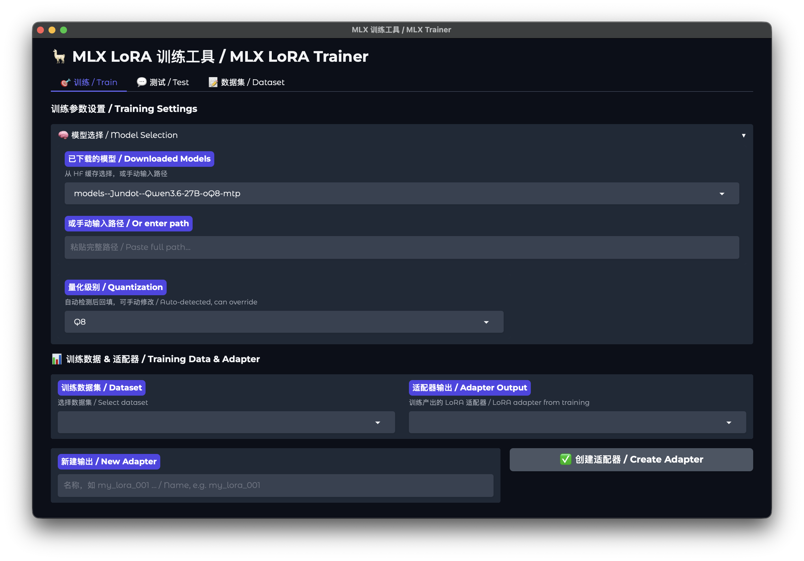
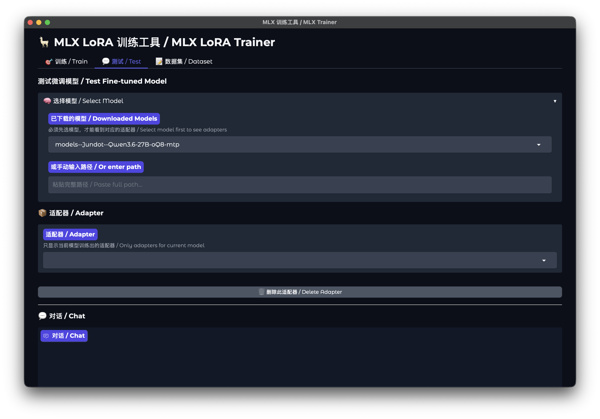
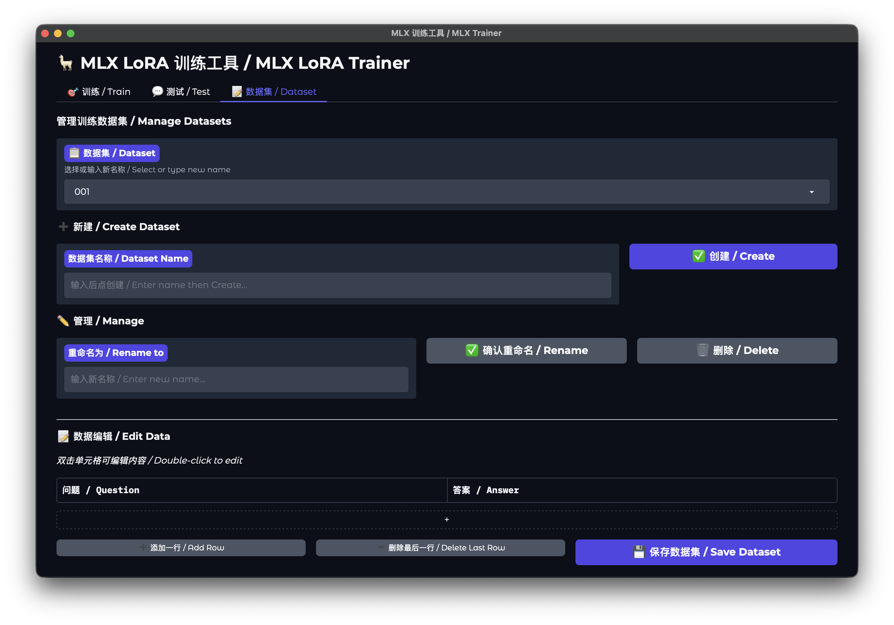

<div align="center">

# 🦙 MLX LoRA 训练工具 v2.0

**Apple Silicon 专属 · 零基础原生桌面 LoRA 微调工具**

[](LICENSE)


</div>

---

## ✨ 核心亮点 / Highlights

### 🖥️ 真正的原生桌面应用，开箱即用 / True Native Desktop App

- 彻底告别浏览器与 localhost 地址，**单 APP 一键启动/关闭**，无后台残留进程 / No browser needed, single-click start/stop
- **全量封装运行依赖**，无需安装 Python、配置 MLX 环境，下载 `.dmg` 拖入应用程序即可使用 / Zero dependencies, drag-and-drop install
- **全程图形化操作**，无需敲任何命令行代码 / 100% GUI, no command line

### 🧑‍💻 全链路小白友好，零门槛跑通微调 / Beginner Friendly

- 所有代码报错、运行日志全部转译为**大白话提示**，附带中英双语说明与解决方案 / All errors translated to plain-language with bilingual solutions
- 预设全场景最优训练参数，仅需 **3 步完成微调**：导入数据集 → 选择基础模型 → 点击开始 / 3 steps to fine-tune
- 训练进度、loss 曲线**实时可视化**，全程清晰掌握训练状态 / Real-time loss curve visualization

### ⚡ 原生 MLX 框架优化，性能拉满 / MLX Powered

- 基于 Apple MLX 框架深度适配，M 系列芯片满血运行，**本地微调无数据泄露风险** / Runs locally, no data leaves your machine
- 保留完整高级参数面板，进阶用户可自由调整训练配置 / Full advanced settings for power users
- 支持 LoRA / QLoRA，自动检测模型量化级别（Q2~Q8） / Auto-detect quantization

---

## 🆕 v2.0 重大更新 / What's New

| 更新 / Update | 说明 / Description |
|------|------|
| 🏗️ **架构全面重构 / Architecture Refactor** | 从 Web 前后端分离模式，升级为纯原生桌面 GUI 应用 / WebUI → native desktop app |
| 💬 **全链路人话报错 / Plain-Language Errors** | 中英双语报错，附带问题说明与解决方案 / Bilingual error messages with solutions |
| 🌐 **中英双语界面 / Bilingual UI** | 全部 UI 文字中英双语呈现 / Complete Chinese/English interface |
| 🎨 **UI 大幅优化 / UI Overhaul** | 界面细节全面改进，操作逻辑更简单直观 / Major UI improvements |
| 🔧 **稳定性提升 / Stability** | 修复进程残留、训练中断、图表数据交织等 / Fixed process leaks, chart bugs |

---

## 📸 界面预览 / Screenshots

### 🎯 训练页面 / Training


### 💬 测试页面 / Test


### 📝 数据集管理 / Dataset


---

## 🚀 快速上手 / Quick Start

### 安装（仅需 2 步）/ Installation

1. 前往 [Releases](https://github.com/PERRYGUO1215/MLX-LoRA-Trainer/releases) 下载最新 `.dmg` / Download the latest `.dmg`
2. 打开安装包，将 `MLX训练.app` 拖入「应用程序」文件夹即可启动 / Drag to Applications folder

> ⚠️ 无需安装任何前置依赖，无需配置环境变量 / No dependencies required

### 3 步完成微调 / 3 Steps to Fine-tune

1. 切换到 **📝 数据集** Tab，输入「问题」和「答案」/ Create dataset with Q&A pairs
2. 切换到 **🎯 训练** Tab，选择模型 → 选择数据集 → 创建适配器 / Select model → dataset → adapter
3. 点击 **▶️ 开始训练**，实时查看 loss 曲线 / Click Start Training, watch the loss curve

---

## 📋 数据集格式 / Dataset Format

支持在 GUI 中直接编辑，也可导入以下标准格式文件：

**JSON 格式**（推荐，支持批量子弹导入）
```json
[
  {"instruction": "你是谁？", "input": "", "output": "我是AI助手。"},
  {"instruction": "什么是机器学习？", "input": "", "output": "机器学习是..."}
]
```

**内部存储格式**：`~/.mlx_train/datasets/<数据集名称>.json`

---

## ⚙️ 训练参数说明 / Training Parameters

| 参数 / Parameter | 默认值 / Default | 说明 / Description |
|------|--------|------|
| 训练层数 / Train Layers | 4 | LoRA 适配的目标层数，越大模型改动越多。不能超过模型总层数 / More layers = more fine-tuning depth |
| 批处理大小 / Batch Size | 1 | 每次训练的样本数。越大训练越快但越耗内存，不能超过数据集条数 / More = faster but more RAM |
| 迭代步数 / Iterations | 20 | 训练的总步数，200 步足以在 0.8B 模型上看到明显效果 / Total training steps |
| 学习率 / Learning Rate | 1e-4 | 控制参数更新幅度，典型范围 1e-5~1e-3。越小越稳定，越大越快 / Smaller = more stable |
| 最大文本长度 / Max Seq Length | 256 | 单条文本的最大 token 数，长文本需要调大 / Increase for longer inputs |

---

## 📋 系统要求 / System Requirements

- **macOS 13.0+**（Apple Silicon，M1/M2/M3/M4）
- **至少 16GB 内存**（推荐 32GB+ 以运行 7B+ 模型） / 16GB+ RAM recommended

---

## ❓ 常见问题 / FAQ

| 问题 / Question | 回答 / Answer |
|------|------|
| **支持哪些设备？/ Supported devices?** | 仅支持 Apple Silicon 芯片的 Mac（M1/M2/M3/M4 全系列）/ Apple Silicon Macs only |
| **需要安装 Python 吗？/ Need Python?** | 不需要，应用已封装全部依赖 / No, all dependencies are bundled |
| **训练数据会上传云端吗？/ Data privacy?** | 不会，所有训练全程本地运行 / All training runs locally |
| **支持哪些模型？/ Supported models?** | 支持 HuggingFace 格式的 MLX 模型 / MLX-format models from HuggingFace |
| **支持继续训练吗？/ Resume training?** | 当前版本暂不支持，每次训练从头开始 / Not yet in v2.0 |

---

## 🛠 技术栈 / Tech Stack

- **[pywebview](https://pywebview.flowrl.com/)** — 原生桌面窗口 / Native desktop window
- **[Gradio](https://www.gradio.app/)** — UI 框架 / UI framework
- **[MLX](https://github.com/ml-explore/mlx)** — Apple Silicon 机器学习框架 / ML framework
- **[mlx-lm](https://github.com/ml-explore/mlx-examples/tree/main/lora)** — LLM 训练与推理 / Training & inference

---

## 🤝 贡献 / Contributing

欢迎提交 Issue 和 PR！/ Issues and PRs welcome!

## 📄 许可证 / License

[MIT](LICENSE)

---

<div align="center">

**如果这个工具对你有帮助，请给一个 ⭐️！/ Give it a ⭐️ if it helps you!**

</div>
